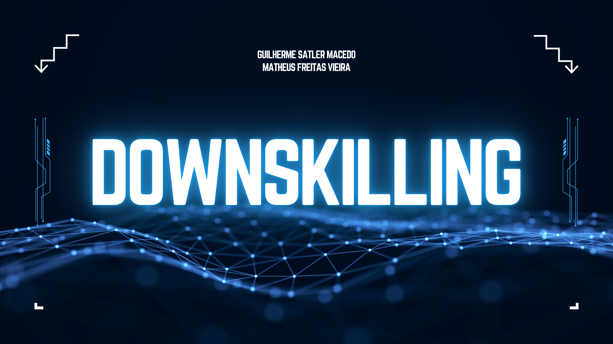

# DownSkilling-Python-MenuColetaDados
Projeto para Global Solutions, um menu para controlar, conferir e facilitar as informações inseridas de um usuário em um banco de dados

## [Clique aqui para acessar a documentação do Código](<GS - DownSkilling - Python - Documentação.pdf>)

### Video Pitch de Storytelling apresentando a Ideia do nosso Projeto para a GS

Clique na imagem para assistir o Video

---

### Arquivo funcional
[Menu.py](Menu.py)

### Arquivo utilizado no desenvolvimento

[Menu.ipynb](src/Dev/Menu.ipynb)